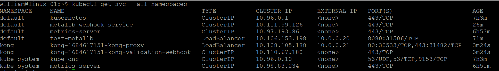
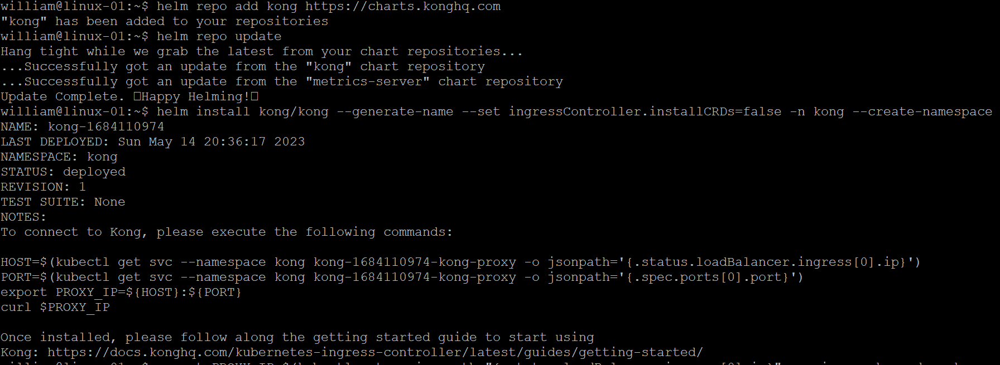

# k8s-gateway-api
Setup k8s gateway api on the vanilla cluster

Install a Gateway controller OR install the Gateway API CRDs manually. As an example, I tried installing controller here.

## 1. Installing MetalLB

Kubernetes does not offer an implementation of network load balancers (Services of type LoadBalancer) for bare-metal clusters. The implementations of network load balancers that Kubernetes does ship with are all glue code that calls out to various IaaS platforms (GCP, AWS, Azure…). If you’re not running on a supported IaaS platform (GCP, AWS, Azure…), LoadBalancers will remain in the “pending” state indefinitely when created.

Bare-metal cluster operators are left with two lesser tools to bring user traffic into their clusters, “NodePort” and “externalIPs” services. Both of these options have significant downsides for production use, which makes bare-metal clusters second-class citizens in the Kubernetes ecosystem.

MetalLB aims to redress this imbalance by offering a network load balancer implementation that integrates with standard network equipment, so that external services on bare-metal clusters also “just work” as much as possible.

    sudo ufw allow 7946/tcp
    sudo ufw allow 7946/udp

Encountered issue when installed by manifest: failed calling webhook "ipaddresspoolvalidationwebhook.metallb.io"

After googled around, it was able to install by helm (Please note that it was installed in the default namespace so the IP configuration yaml files were also modified to use default namespace) and then configured to enable kong-proxy as loadbalancer service to get the EXTERNAL-IP (from pending status).

    helm repo add metallb https://metallb.github.io/metallb
    helm install metallb metallb/metallb --set crds.validationFailurePolicy=Ignore

    kubectl apply -f metallb/IPAddressPool.yaml
    kubectl apply -f metallb/L2Advertisement.yaml

Both service "test-metallb" and kong-proxy got IPs from the specified pool:

Delete metallb:

    helm delete metallb

## 2. Installing an Ingress and Gateway APIs controller

Chose Kong Kubernetes Ingress Controller (KIC) which supports Gateway API. Install Kong via the official Helm chart:

    helm repo add kong https://charts.konghq.com
    helm repo update

    # Helm 3
    helm install kong/kong --generate-name --set ingressController.installCRDs=false -n kong --create-namespace

    HOST=$(kubectl get svc --namespace kong kong-1684617151-kong-proxy -o jsonpath='{.status.loadBalancer.ingress[0].ip}')
    PORT=$(kubectl get svc --namespace kong kong-1684617151-kong-proxy -o jsonpath='{.spec.ports[0].port}')
    export PROXY_IP=${HOST}:${PORT}
    curl $PROXY_IP

After install MetalLB, run these commands to test:

    HOST=$(kubectl get svc --namespace kong kong-1684593385-kong-proxy -o jsonpath='{.status.loadBalancer.ingress[0].ip}')
    PORT=$(kubectl get svc --namespace kong kong-1684593385-kong-proxy -o jsonpath='{.spec.ports[0].port}')
    export PROXY_IP=${HOST}:${PORT}
    curl $PROXY_IP

Installing Gateway API: Standard Channel

    kubectl apply -f https://github.com/kubernetes-sigs/gateway-api/releases/download/v0.7.0/standard-install.yaml

## References

(1). https://docs.konghq.com/kubernetes-ingress-controller/2.9.x/guides/getting-started/

(2). https://docs.konghq.com/kubernetes-ingress-controller/2.9.x/concepts/deployment/

(3). https://docs.konghq.com/kubernetes-ingress-controller/2.9.x/deployment/k4k8s/

(4). https://docs.konghq.com/kubernetes-ingress-controller/2.9.x/deployment/install-gateway-apis/

(5). https://gateway-api.sigs.k8s.io/guides/#installing-gateway-api

(6). https://metallb.universe.tf/

(7). https://github.com/metallb/metallb/issues/1697

(8). https://www.cnblogs.com/netsa/p/17178218.html
